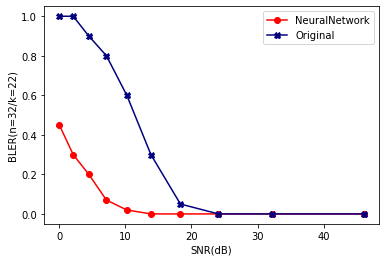

```python
import tensorflow as tf
import numpy as np
import matplotlib.pyplot as plt
import random
```


```python
def BPSKmod(Y):
    X=Y.copy()
    index0=[X[i]==0 for i in range(X.shape[0])]
    index1=[X[i]==1 for i in range(X.shape[0])]
    X[index0]=1
    X[index1]=-1
    return X
def uTH(Y):
    X=Y.copy()
    index0=X<0.5
    index1=X>=0.5
    X[index0]=0
    X[index1]=1
    return X
```


```python
m=10000 # number of training examples.
n=32 # codeword size.
std=1 # standard deviation
testDataSplit=0.1
```


```python
Y=np.random.randint(low=0,high=2,size=(m,n))
X=BPSKmod(Y)+np.random.normal(0,std,size=(m,n))
iTest=[i for i in range( int(testDataSplit*X.shape[0]) )]
iTrain=[i for i in range( int((1-testDataSplit)*X.shape[0]) )]
Xtr=X[iTrain];Ytr=Y[iTrain]
Xte=X[iTest];Yte=Y[iTest]
```


```python
noOfExamples=10
def evalModel(model):
    print(model.evaluate(Xte,Yte,verbose=2))
    for i in range(noOfExamples):
        index=np.random.randint(low=0,high=Xte.shape[0])
        Yte_P=model.predict(Xte)
        print('Actual Value -> ',uTH(Yte_P[index]))
        print('Predicted Value -> ',Yte[index])
        print('--------------------')
```


```python
model=tf.keras.Sequential([
    tf.keras.layers.Dense(2*Xtr.shape[1],activation='tanh'),
    tf.keras.layers.Dense(2*Xtr.shape[1],activation='tanh'),
    tf.keras.layers.Dense(2*Xtr.shape[1],activation='tanh'),
    tf.keras.layers.Dense(Xtr.shape[1],activation='sigmoid')
])
model.compile(optimizer='adam',
              loss=tf.keras.losses.MeanSquaredError(),
              metrics=['categorical_accuracy'])
model.fit(Xtr,Ytr,epochs=100)
evalModel(model)
```

    Epoch 1/100
    282/282 [==============================] - 1s 2ms/step - loss: 0.1341 - categorical_accuracy: 0.0489
    Epoch 2/100
    282/282 [==============================] - 0s 2ms/step - loss: 0.0600 - categorical_accuracy: 0.0574
    Epoch 3/100
    282/282 [==============================] - 0s 2ms/step - loss: 0.0414 - categorical_accuracy: 0.0571
    Epoch 4/100
    282/282 [==============================] - 0s 2ms/step - loss: 0.0336 - categorical_accuracy: 0.0624
    Epoch 5/100
    282/282 [==============================] - 0s 1ms/step - loss: 0.0286 - categorical_accuracy: 0.0597
    Epoch 6/100
    282/282 [==============================] - 0s 1ms/step - loss: 0.0252 - categorical_accuracy: 0.0623
    Epoch 7/100
    282/282 [==============================] - 0s 1ms/step - loss: 0.0227 - categorical_accuracy: 0.0650
    Epoch 8/100
    282/282 [==============================] - 0s 1ms/step - loss: 0.0208 - categorical_accuracy: 0.0657
    Epoch 9/100
    282/282 [==============================] - 0s 1ms/step - loss: 0.0192 - categorical_accuracy: 0.0626
    Epoch 10/100
    282/282 [==============================] - 0s 1ms/step - loss: 0.0180 - categorical_accuracy: 0.0653
    Epoch 11/100
    282/282 [==============================] - 0s 1ms/step - loss: 0.0170 - categorical_accuracy: 0.0677
    Epoch 12/100
    282/282 [==============================] - 0s 1ms/step - loss: 0.0161 - categorical_accuracy: 0.0640
    Epoch 13/100
    282/282 [==============================] - 0s 2ms/step - loss: 0.0153 - categorical_accuracy: 0.0669
    Epoch 14/100
    282/282 [==============================] - 1s 2ms/step - loss: 0.0147 - categorical_accuracy: 0.0686
    Epoch 15/100
    282/282 [==============================] - 0s 1ms/step - loss: 0.0141 - categorical_accuracy: 0.0666
    Epoch 16/100
    282/282 [==============================] - 0s 1ms/step - loss: 0.0136 - categorical_accuracy: 0.0706
    Epoch 17/100
    282/282 [==============================] - 0s 1ms/step - loss: 0.0132 - categorical_accuracy: 0.0667
    Epoch 18/100
    282/282 [==============================] - 0s 1ms/step - loss: 0.0127 - categorical_accuracy: 0.0659
    Epoch 19/100
    282/282 [==============================] - 0s 2ms/step - loss: 0.0124 - categorical_accuracy: 0.0659
    Epoch 20/100
    282/282 [==============================] - 0s 2ms/step - loss: 0.0120 - categorical_accuracy: 0.0657
    Epoch 21/100
    282/282 [==============================] - 0s 2ms/step - loss: 0.0117 - categorical_accuracy: 0.0683
    Epoch 22/100
    282/282 [==============================] - 0s 1ms/step - loss: 0.0113 - categorical_accuracy: 0.0684
    Epoch 23/100
    282/282 [==============================] - 0s 1ms/step - loss: 0.0111 - categorical_accuracy: 0.0696
    Epoch 24/100
    282/282 [==============================] - 0s 2ms/step - loss: 0.0108 - categorical_accuracy: 0.0683
    Epoch 25/100
    282/282 [==============================] - 0s 2ms/step - loss: 0.0106 - categorical_accuracy: 0.0670
    Epoch 26/100
    282/282 [==============================] - 0s 2ms/step - loss: 0.0104 - categorical_accuracy: 0.0696
    Epoch 27/100
    282/282 [==============================] - 1s 2ms/step - loss: 0.0102 - categorical_accuracy: 0.0674
    Epoch 28/100
    282/282 [==============================] - 1s 2ms/step - loss: 0.0100 - categorical_accuracy: 0.0723
    Epoch 29/100
    282/282 [==============================] - 0s 2ms/step - loss: 0.0098 - categorical_accuracy: 0.0656
    Epoch 30/100
    282/282 [==============================] - 0s 2ms/step - loss: 0.0096 - categorical_accuracy: 0.0684
    Epoch 31/100
    282/282 [==============================] - 0s 2ms/step - loss: 0.0094 - categorical_accuracy: 0.0696
    Epoch 32/100
    282/282 [==============================] - 0s 2ms/step - loss: 0.0093 - categorical_accuracy: 0.0687
    Epoch 33/100
    282/282 [==============================] - 0s 2ms/step - loss: 0.0091 - categorical_accuracy: 0.0680
    Epoch 34/100
    282/282 [==============================] - 0s 1ms/step - loss: 0.0090 - categorical_accuracy: 0.0679
    Epoch 35/100
    282/282 [==============================] - 0s 2ms/step - loss: 0.0088 - categorical_accuracy: 0.0656
    Epoch 36/100
    282/282 [==============================] - 0s 1ms/step - loss: 0.0087 - categorical_accuracy: 0.0662
    Epoch 37/100
    282/282 [==============================] - 0s 1ms/step - loss: 0.0085 - categorical_accuracy: 0.0682
    Epoch 38/100
    282/282 [==============================] - 0s 2ms/step - loss: 0.0084 - categorical_accuracy: 0.0671
    Epoch 39/100
    282/282 [==============================] - 0s 1ms/step - loss: 0.0083 - categorical_accuracy: 0.0686
    Epoch 40/100
    282/282 [==============================] - 0s 2ms/step - loss: 0.0081 - categorical_accuracy: 0.0687
    Epoch 41/100
    282/282 [==============================] - 0s 1ms/step - loss: 0.0081 - categorical_accuracy: 0.0692
    Epoch 42/100
    282/282 [==============================] - 0s 1ms/step - loss: 0.0079 - categorical_accuracy: 0.0661
    Epoch 43/100
    282/282 [==============================] - 0s 1ms/step - loss: 0.0079 - categorical_accuracy: 0.0683
    Epoch 44/100
    282/282 [==============================] - 0s 1ms/step - loss: 0.0077 - categorical_accuracy: 0.0657
    Epoch 45/100
    282/282 [==============================] - 0s 1ms/step - loss: 0.0077 - categorical_accuracy: 0.0700
    Epoch 46/100
    282/282 [==============================] - 0s 1ms/step - loss: 0.0075 - categorical_accuracy: 0.0691
    Epoch 47/100
    282/282 [==============================] - 0s 1ms/step - loss: 0.0074 - categorical_accuracy: 0.0672
    Epoch 48/100
    282/282 [==============================] - 0s 1ms/step - loss: 0.0073 - categorical_accuracy: 0.0709
    Epoch 49/100
    282/282 [==============================] - 0s 1ms/step - loss: 0.0072 - categorical_accuracy: 0.0728
    Epoch 50/100
    282/282 [==============================] - 0s 1ms/step - loss: 0.0071 - categorical_accuracy: 0.0707: 0s - loss: 0.0070 - categorical_accu
    Epoch 51/100
    282/282 [==============================] - 0s 1ms/step - loss: 0.0070 - categorical_accuracy: 0.0718
    Epoch 52/100
    282/282 [==============================] - 0s 1ms/step - loss: 0.0070 - categorical_accuracy: 0.0680
    Epoch 53/100
    282/282 [==============================] - 0s 1ms/step - loss: 0.0069 - categorical_accuracy: 0.0711
    Epoch 54/100
    282/282 [==============================] - 0s 2ms/step - loss: 0.0068 - categorical_accuracy: 0.0698
    Epoch 55/100
    282/282 [==============================] - 0s 1ms/step - loss: 0.0067 - categorical_accuracy: 0.0724
    Epoch 56/100
    282/282 [==============================] - 0s 2ms/step - loss: 0.0066 - categorical_accuracy: 0.0698
    Epoch 57/100
    282/282 [==============================] - 0s 1ms/step - loss: 0.0065 - categorical_accuracy: 0.0658
    Epoch 58/100
    282/282 [==============================] - 0s 1ms/step - loss: 0.0064 - categorical_accuracy: 0.0713
    Epoch 59/100
    282/282 [==============================] - 0s 1ms/step - loss: 0.0064 - categorical_accuracy: 0.0714
    Epoch 60/100
    282/282 [==============================] - 0s 1ms/step - loss: 0.0063 - categorical_accuracy: 0.0744
    Epoch 61/100
    282/282 [==============================] - 0s 1ms/step - loss: 0.0062 - categorical_accuracy: 0.0731
    Epoch 62/100
    282/282 [==============================] - 0s 1ms/step - loss: 0.0061 - categorical_accuracy: 0.0724
    Epoch 63/100
    282/282 [==============================] - 0s 1ms/step - loss: 0.0060 - categorical_accuracy: 0.0749
    Epoch 64/100
    282/282 [==============================] - 0s 1ms/step - loss: 0.0060 - categorical_accuracy: 0.0712
    Epoch 65/100
    282/282 [==============================] - 0s 1ms/step - loss: 0.0059 - categorical_accuracy: 0.0710
    Epoch 66/100
    282/282 [==============================] - 0s 1ms/step - loss: 0.0058 - categorical_accuracy: 0.0746
    Epoch 67/100
    282/282 [==============================] - 0s 1ms/step - loss: 0.0058 - categorical_accuracy: 0.0694
    Epoch 68/100
    282/282 [==============================] - 0s 1ms/step - loss: 0.0057 - categorical_accuracy: 0.0750
    Epoch 69/100
    282/282 [==============================] - 0s 1ms/step - loss: 0.0056 - categorical_accuracy: 0.0688
    Epoch 70/100
    282/282 [==============================] - 0s 1ms/step - loss: 0.0056 - categorical_accuracy: 0.0698
    Epoch 71/100
    282/282 [==============================] - 0s 1ms/step - loss: 0.0055 - categorical_accuracy: 0.0741
    Epoch 72/100
    282/282 [==============================] - 0s 2ms/step - loss: 0.0055 - categorical_accuracy: 0.0720
    Epoch 73/100
    282/282 [==============================] - 0s 1ms/step - loss: 0.0054 - categorical_accuracy: 0.0748
    Epoch 74/100
    282/282 [==============================] - 0s 1ms/step - loss: 0.0054 - categorical_accuracy: 0.0712
    Epoch 75/100
    282/282 [==============================] - 0s 1ms/step - loss: 0.0053 - categorical_accuracy: 0.0704
    Epoch 76/100
    282/282 [==============================] - 0s 2ms/step - loss: 0.0052 - categorical_accuracy: 0.0728
    Epoch 77/100
    282/282 [==============================] - 0s 1ms/step - loss: 0.0052 - categorical_accuracy: 0.0721
    Epoch 78/100
    282/282 [==============================] - 0s 1ms/step - loss: 0.0051 - categorical_accuracy: 0.0724
    Epoch 79/100
    282/282 [==============================] - 0s 1ms/step - loss: 0.0050 - categorical_accuracy: 0.0744
    Epoch 80/100
    282/282 [==============================] - 0s 1ms/step - loss: 0.0049 - categorical_accuracy: 0.0710
    Epoch 81/100
    282/282 [==============================] - 0s 1ms/step - loss: 0.0049 - categorical_accuracy: 0.0690
    Epoch 82/100
    282/282 [==============================] - 0s 1ms/step - loss: 0.0048 - categorical_accuracy: 0.0674
    Epoch 83/100
    282/282 [==============================] - 0s 2ms/step - loss: 0.0048 - categorical_accuracy: 0.0704
    Epoch 84/100
    282/282 [==============================] - 0s 2ms/step - loss: 0.0047 - categorical_accuracy: 0.0697
    Epoch 85/100
    282/282 [==============================] - 0s 1ms/step - loss: 0.0046 - categorical_accuracy: 0.0677
    Epoch 86/100
    282/282 [==============================] - 0s 2ms/step - loss: 0.0046 - categorical_accuracy: 0.0684
    Epoch 87/100
    282/282 [==============================] - 0s 2ms/step - loss: 0.0046 - categorical_accuracy: 0.0699: 0s - loss: 0.0045 - categorical_accuracy: 0.06
    Epoch 88/100
    282/282 [==============================] - 1s 2ms/step - loss: 0.0044 - categorical_accuracy: 0.0699
    Epoch 89/100
    282/282 [==============================] - 0s 2ms/step - loss: 0.0044 - categorical_accuracy: 0.0701
    Epoch 90/100
    282/282 [==============================] - 1s 2ms/step - loss: 0.0044 - categorical_accuracy: 0.0692
    Epoch 91/100
    282/282 [==============================] - 0s 2ms/step - loss: 0.0043 - categorical_accuracy: 0.0666
    Epoch 92/100
    282/282 [==============================] - 0s 2ms/step - loss: 0.0042 - categorical_accuracy: 0.0721
    Epoch 93/100
    282/282 [==============================] - 0s 2ms/step - loss: 0.0042 - categorical_accuracy: 0.0687
    Epoch 94/100
    282/282 [==============================] - 0s 2ms/step - loss: 0.0042 - categorical_accuracy: 0.0667
    Epoch 95/100
    282/282 [==============================] - 0s 1ms/step - loss: 0.0041 - categorical_accuracy: 0.0691
    Epoch 96/100
    282/282 [==============================] - 0s 2ms/step - loss: 0.0041 - categorical_accuracy: 0.0723
    Epoch 97/100
    282/282 [==============================] - 0s 2ms/step - loss: 0.0040 - categorical_accuracy: 0.0629
    Epoch 98/100
    282/282 [==============================] - 0s 2ms/step - loss: 0.0040 - categorical_accuracy: 0.0662
    Epoch 99/100
    282/282 [==============================] - 1s 2ms/step - loss: 0.0039 - categorical_accuracy: 0.0588
    Epoch 100/100
    282/282 [==============================] - 0s 1ms/step - loss: 0.0038 - categorical_accuracy: 0.0604
    32/32 - 0s - loss: 0.0035 - categorical_accuracy: 0.0720
    [0.0035364809446036816, 0.07199999690055847]
    Actual Value ->  [0. 0. 0. 0. 0. 0. 1. 0. 1. 1. 1. 0. 1. 0. 1. 0. 1. 1. 0. 0. 0. 1. 0. 1.
     1. 0. 0. 0. 0. 0. 0. 0.]
    Predicted Value ->  [0 0 0 0 0 0 1 0 1 1 1 0 1 0 1 0 1 1 0 0 0 1 0 1 1 0 0 0 0 0 0 0]
    --------------------
    Actual Value ->  [1. 0. 1. 1. 0. 0. 0. 1. 1. 1. 0. 1. 0. 1. 1. 1. 0. 0. 0. 0. 1. 0. 0. 1.
     1. 0. 1. 0. 0. 1. 1. 1.]
    Predicted Value ->  [1 0 1 1 0 0 0 1 1 1 0 1 0 1 1 1 0 0 0 0 1 0 0 1 1 0 1 0 0 1 1 1]
    --------------------
    Actual Value ->  [0. 0. 0. 1. 0. 1. 1. 1. 1. 0. 0. 0. 1. 1. 1. 1. 0. 1. 1. 0. 1. 1. 0. 0.
     1. 1. 0. 0. 0. 0. 0. 1.]
    Predicted Value ->  [0 0 0 1 0 1 1 1 1 0 0 0 1 1 1 1 0 1 1 0 1 1 0 0 1 1 0 0 0 0 0 1]
    --------------------
    Actual Value ->  [1. 1. 1. 0. 1. 0. 0. 0. 0. 1. 1. 0. 1. 0. 1. 0. 0. 1. 1. 0. 1. 0. 1. 1.
     0. 1. 0. 1. 0. 1. 1. 0.]
    Predicted Value ->  [1 1 1 0 1 0 0 0 0 1 1 0 1 0 1 0 0 1 1 0 1 0 1 1 0 1 0 1 0 1 1 0]
    --------------------
    Actual Value ->  [1. 1. 0. 1. 1. 0. 0. 1. 0. 1. 0. 0. 0. 0. 1. 0. 0. 0. 0. 1. 1. 0. 1. 1.
     1. 0. 0. 1. 1. 0. 1. 0.]
    Predicted Value ->  [1 1 0 1 1 0 0 1 0 1 0 0 0 0 1 0 0 0 0 0 1 0 1 1 1 0 0 1 1 0 1 0]
    --------------------
    Actual Value ->  [0. 1. 1. 1. 1. 1. 0. 0. 1. 0. 1. 0. 0. 1. 1. 1. 1. 1. 1. 1. 0. 1. 1. 1.
     0. 1. 1. 1. 1. 0. 0. 1.]
    Predicted Value ->  [0 1 1 1 1 1 0 0 1 0 1 0 0 1 1 1 1 1 1 1 0 1 1 1 0 1 1 1 1 0 0 1]
    --------------------
    Actual Value ->  [1. 1. 0. 1. 1. 1. 0. 1. 0. 0. 0. 0. 1. 0. 0. 0. 1. 0. 0. 0. 0. 1. 1. 0.
     1. 0. 1. 0. 1. 1. 0. 1.]
    Predicted Value ->  [1 1 0 1 1 1 0 1 0 0 0 0 1 0 0 0 1 0 0 0 0 1 1 0 1 0 1 0 1 1 0 1]
    --------------------
    Actual Value ->  [1. 0. 0. 0. 1. 0. 0. 1. 1. 1. 1. 0. 0. 0. 1. 1. 0. 1. 0. 1. 0. 0. 1. 1.
     0. 0. 1. 1. 1. 0. 1. 1.]
    Predicted Value ->  [1 0 0 0 1 0 0 1 1 1 1 0 0 0 1 1 0 1 0 1 0 0 1 1 0 0 1 1 1 0 1 1]
    --------------------
    Actual Value ->  [1. 0. 0. 0. 1. 0. 1. 1. 1. 0. 1. 0. 1. 0. 0. 0. 0. 0. 0. 0. 1. 1. 0. 0.
     1. 0. 0. 0. 1. 1. 1. 0.]
    Predicted Value ->  [1 0 0 0 1 0 1 1 1 0 1 0 1 0 0 0 0 0 0 0 1 1 0 0 1 0 0 0 1 1 1 0]
    --------------------
    Actual Value ->  [1. 0. 0. 0. 1. 0. 1. 0. 1. 1. 1. 1. 1. 1. 0. 1. 0. 1. 0. 0. 0. 1. 1. 1.
     1. 0. 1. 0. 1. 1. 1. 1.]
    Predicted Value ->  [1 0 0 0 1 0 1 0 1 1 1 1 1 1 0 1 0 1 0 0 0 1 1 1 1 0 1 0 1 1 1 1]
    --------------------
    


```python
model=tf.keras.Sequential([
    tf.keras.layers.Dense(2*Xtr.shape[1],activation='tanh'),
    tf.keras.layers.Dense(2*Xtr.shape[1],activation='tanh'),
    tf.keras.layers.Dense(2*Xtr.shape[1],activation='tanh'),
    tf.keras.layers.Dense(Xtr.shape[1],activation='sigmoid')
])
model.compile(optimizer='adam',
              loss=tf.keras.losses.CategoricalCrossentropy(),
              metrics=['categorical_accuracy'])
model.fit(Xtr,Ytr,epochs=100)
evalModel(model)
```

    Epoch 1/100
    282/282 [==============================] - 0s 1ms/step - loss: 0.6304 - categorical_accuracy: 0.5998
    Epoch 2/100
    282/282 [==============================] - 0s 1ms/step - loss: 0.4238 - categorical_accuracy: 0.7529
    Epoch 3/100
    282/282 [==============================] - 0s 1ms/step - loss: 0.3769 - categorical_accuracy: 0.7692
    Epoch 4/100
    282/282 [==============================] - 0s 1ms/step - loss: 0.3621 - categorical_accuracy: 0.8106
    Epoch 5/100
    282/282 [==============================] - 0s 1ms/step - loss: 0.3555 - categorical_accuracy: 0.8418
    Epoch 6/100
    282/282 [==============================] - 0s 1ms/step - loss: 0.3519 - categorical_accuracy: 0.8429
    Epoch 7/100
    282/282 [==============================] - 0s 1ms/step - loss: 0.3498 - categorical_accuracy: 0.8501
    Epoch 8/100
    282/282 [==============================] - 0s 1ms/step - loss: 0.3483 - categorical_accuracy: 0.6180
    Epoch 9/100
    282/282 [==============================] - 0s 1ms/step - loss: 0.3474 - categorical_accuracy: 0.6196
    Epoch 10/100
    282/282 [==============================] - 0s 1ms/step - loss: 0.3467 - categorical_accuracy: 0.6313
    Epoch 11/100
    282/282 [==============================] - 0s 1ms/step - loss: 0.3462 - categorical_accuracy: 0.6221
    Epoch 12/100
    282/282 [==============================] - 0s 1ms/step - loss: 0.3458 - categorical_accuracy: 0.6230
    Epoch 13/100
    282/282 [==============================] - 0s 1ms/step - loss: 0.3454 - categorical_accuracy: 0.6221
    Epoch 14/100
    282/282 [==============================] - 0s 1ms/step - loss: 0.3452 - categorical_accuracy: 0.6251
    Epoch 15/100
    282/282 [==============================] - 0s 1ms/step - loss: 0.3450 - categorical_accuracy: 0.6303
    Epoch 16/100
    282/282 [==============================] - 0s 2ms/step - loss: 0.3448 - categorical_accuracy: 0.6196
    Epoch 17/100
    282/282 [==============================] - 0s 1ms/step - loss: 0.3447 - categorical_accuracy: 0.6236
    Epoch 18/100
    282/282 [==============================] - 0s 1ms/step - loss: 0.3447 - categorical_accuracy: 0.6240
    Epoch 19/100
    282/282 [==============================] - 0s 1ms/step - loss: 0.3445 - categorical_accuracy: 0.6250
    Epoch 20/100
    282/282 [==============================] - 0s 1ms/step - loss: 0.3444 - categorical_accuracy: 0.6223: 0s - loss: 0.3398 - categorical_accuracy: 
    Epoch 21/100
    282/282 [==============================] - 0s 1ms/step - loss: 0.3444 - categorical_accuracy: 0.6164
    Epoch 22/100
    282/282 [==============================] - 0s 1ms/step - loss: 0.3443 - categorical_accuracy: 0.6243
    Epoch 23/100
    282/282 [==============================] - 0s 1ms/step - loss: 0.3443 - categorical_accuracy: 0.6322
    Epoch 24/100
    282/282 [==============================] - 0s 1ms/step - loss: 0.3442 - categorical_accuracy: 0.6252
    Epoch 25/100
    282/282 [==============================] - 0s 2ms/step - loss: 0.3442 - categorical_accuracy: 0.6293
    Epoch 26/100
    282/282 [==============================] - 0s 1ms/step - loss: 0.3442 - categorical_accuracy: 0.6239
    Epoch 27/100
    282/282 [==============================] - 0s 1ms/step - loss: 0.3441 - categorical_accuracy: 0.6281
    Epoch 28/100
    282/282 [==============================] - 1s 2ms/step - loss: 0.3441 - categorical_accuracy: 0.6296
    Epoch 29/100
    282/282 [==============================] - 0s 1ms/step - loss: 0.3441 - categorical_accuracy: 0.6291
    Epoch 30/100
    282/282 [==============================] - 0s 1ms/step - loss: 0.3441 - categorical_accuracy: 0.6303
    Epoch 31/100
    282/282 [==============================] - 0s 1ms/step - loss: 0.3441 - categorical_accuracy: 0.6271
    Epoch 32/100
    282/282 [==============================] - 0s 2ms/step - loss: 0.3441 - categorical_accuracy: 0.6257
    Epoch 33/100
    282/282 [==============================] - 0s 1ms/step - loss: 0.3440 - categorical_accuracy: 0.6313
    Epoch 34/100
    282/282 [==============================] - 0s 1ms/step - loss: 0.3440 - categorical_accuracy: 0.6246
    Epoch 35/100
    282/282 [==============================] - 1s 2ms/step - loss: 0.3440 - categorical_accuracy: 0.6267: 0s - loss: 0.3548 - categorical_accuracy: 
    Epoch 36/100
    282/282 [==============================] - 0s 2ms/step - loss: 0.3441 - categorical_accuracy: 0.6318
    Epoch 37/100
    282/282 [==============================] - 0s 1ms/step - loss: 0.3440 - categorical_accuracy: 0.6168
    Epoch 38/100
    282/282 [==============================] - 0s 1ms/step - loss: 0.3440 - categorical_accuracy: 0.6291
    Epoch 39/100
    282/282 [==============================] - 0s 1ms/step - loss: 0.3440 - categorical_accuracy: 0.6269
    Epoch 40/100
    282/282 [==============================] - 0s 1ms/step - loss: 0.3440 - categorical_accuracy: 0.6299
    Epoch 41/100
    282/282 [==============================] - 0s 1ms/step - loss: 0.3440 - categorical_accuracy: 0.6234
    Epoch 42/100
    282/282 [==============================] - 0s 1ms/step - loss: 0.3440 - categorical_accuracy: 0.6240
    Epoch 43/100
    282/282 [==============================] - 0s 1ms/step - loss: 0.3440 - categorical_accuracy: 0.6284
    Epoch 44/100
    282/282 [==============================] - 0s 1ms/step - loss: 0.3441 - categorical_accuracy: 0.6300
    Epoch 45/100
    282/282 [==============================] - 0s 1ms/step - loss: 0.3440 - categorical_accuracy: 0.6256
    Epoch 46/100
    282/282 [==============================] - 0s 1ms/step - loss: 0.3440 - categorical_accuracy: 0.6098
    Epoch 47/100
    282/282 [==============================] - 0s 1ms/step - loss: 0.3440 - categorical_accuracy: 0.6127
    Epoch 48/100
    282/282 [==============================] - 0s 1ms/step - loss: 0.3440 - categorical_accuracy: 0.6188
    Epoch 49/100
    282/282 [==============================] - 0s 1ms/step - loss: 0.3440 - categorical_accuracy: 0.6216
    Epoch 50/100
    282/282 [==============================] - 0s 1ms/step - loss: 0.3440 - categorical_accuracy: 0.6198
    Epoch 51/100
    282/282 [==============================] - 0s 1ms/step - loss: 0.3440 - categorical_accuracy: 0.6272
    Epoch 52/100
    282/282 [==============================] - 0s 1ms/step - loss: 0.3441 - categorical_accuracy: 0.6281
    Epoch 53/100
    282/282 [==============================] - 0s 1ms/step - loss: 0.3440 - categorical_accuracy: 0.6249
    Epoch 54/100
    282/282 [==============================] - 0s 1ms/step - loss: 0.3440 - categorical_accuracy: 0.6210
    Epoch 55/100
    282/282 [==============================] - 0s 1ms/step - loss: 0.3440 - categorical_accuracy: 0.6247
    Epoch 56/100
    282/282 [==============================] - 0s 2ms/step - loss: 0.3440 - categorical_accuracy: 0.6267
    Epoch 57/100
    282/282 [==============================] - 0s 1ms/step - loss: 0.3440 - categorical_accuracy: 0.6247
    Epoch 58/100
    282/282 [==============================] - 0s 1ms/step - loss: 0.3441 - categorical_accuracy: 0.6261
    Epoch 59/100
    282/282 [==============================] - 0s 1ms/step - loss: 0.3440 - categorical_accuracy: 0.6230
    Epoch 60/100
    282/282 [==============================] - 0s 1ms/step - loss: 0.3440 - categorical_accuracy: 0.6210
    Epoch 61/100
    282/282 [==============================] - 0s 1ms/step - loss: 0.3440 - categorical_accuracy: 0.6261
    Epoch 62/100
    282/282 [==============================] - 0s 2ms/step - loss: 0.3440 - categorical_accuracy: 0.6290
    Epoch 63/100
    282/282 [==============================] - 1s 2ms/step - loss: 0.3440 - categorical_accuracy: 0.6214
    Epoch 64/100
    282/282 [==============================] - 1s 2ms/step - loss: 0.3440 - categorical_accuracy: 0.6266
    Epoch 65/100
    282/282 [==============================] - ETA: 0s - loss: 0.3476 - categorical_accuracy: 0.62 - 1s 2ms/step - loss: 0.3440 - categorical_accuracy: 0.6263
    Epoch 66/100
    282/282 [==============================] - 0s 2ms/step - loss: 0.3440 - categorical_accuracy: 0.6246
    Epoch 67/100
    282/282 [==============================] - 0s 2ms/step - loss: 0.3440 - categorical_accuracy: 0.6283
    Epoch 68/100
    282/282 [==============================] - 1s 2ms/step - loss: 0.3440 - categorical_accuracy: 0.6196
    Epoch 69/100
    282/282 [==============================] - 0s 2ms/step - loss: 0.3440 - categorical_accuracy: 0.8166
    Epoch 70/100
    282/282 [==============================] - 0s 1ms/step - loss: 0.3440 - categorical_accuracy: 0.8713
    Epoch 71/100
    282/282 [==============================] - 0s 2ms/step - loss: 0.3440 - categorical_accuracy: 0.8736
    Epoch 72/100
    282/282 [==============================] - 0s 1ms/step - loss: 0.3440 - categorical_accuracy: 0.8781: 0s - loss: 0.3461 - categorical_accuracy: 
    Epoch 73/100
    282/282 [==============================] - 0s 1ms/step - loss: 0.3440 - categorical_accuracy: 0.8793
    Epoch 74/100
    282/282 [==============================] - 0s 1ms/step - loss: 0.3440 - categorical_accuracy: 0.8749
    Epoch 75/100
    282/282 [==============================] - 0s 2ms/step - loss: 0.3440 - categorical_accuracy: 0.8762
    Epoch 76/100
    282/282 [==============================] - 0s 1ms/step - loss: 0.3440 - categorical_accuracy: 0.8719
    Epoch 77/100
    282/282 [==============================] - 0s 1ms/step - loss: 0.3440 - categorical_accuracy: 0.8797
    Epoch 78/100
    282/282 [==============================] - 0s 1ms/step - loss: 0.3440 - categorical_accuracy: 0.8831
    Epoch 79/100
    282/282 [==============================] - 0s 1ms/step - loss: 0.3440 - categorical_accuracy: 0.8768
    Epoch 80/100
    282/282 [==============================] - 0s 1ms/step - loss: 0.3440 - categorical_accuracy: 0.8782
    Epoch 81/100
    282/282 [==============================] - 0s 1ms/step - loss: 0.3441 - categorical_accuracy: 0.8733
    Epoch 82/100
    282/282 [==============================] - ETA: 0s - loss: 0.3435 - categorical_accuracy: 0.87 - 0s 1ms/step - loss: 0.3440 - categorical_accuracy: 0.8726
    Epoch 83/100
    282/282 [==============================] - 0s 2ms/step - loss: 0.3440 - categorical_accuracy: 0.8723
    Epoch 84/100
    282/282 [==============================] - 0s 1ms/step - loss: 0.3440 - categorical_accuracy: 0.8719
    Epoch 85/100
    282/282 [==============================] - 0s 1ms/step - loss: 0.3440 - categorical_accuracy: 0.8724
    Epoch 86/100
    282/282 [==============================] - 0s 1ms/step - loss: 0.3440 - categorical_accuracy: 0.8707
    Epoch 87/100
    282/282 [==============================] - 0s 1ms/step - loss: 0.3440 - categorical_accuracy: 0.8694
    Epoch 88/100
    282/282 [==============================] - 0s 1ms/step - loss: 0.3440 - categorical_accuracy: 0.8847
    Epoch 89/100
    282/282 [==============================] - 0s 1ms/step - loss: 0.3442 - categorical_accuracy: 0.8753
    Epoch 90/100
    282/282 [==============================] - 0s 1ms/step - loss: 0.3440 - categorical_accuracy: 0.8697
    Epoch 91/100
    282/282 [==============================] - 0s 1ms/step - loss: 0.3440 - categorical_accuracy: 0.8749
    Epoch 92/100
    282/282 [==============================] - 0s 1ms/step - loss: 0.3440 - categorical_accuracy: 0.8722
    Epoch 93/100
    282/282 [==============================] - 0s 1ms/step - loss: 0.3440 - categorical_accuracy: 0.8703
    Epoch 94/100
    282/282 [==============================] - 0s 1ms/step - loss: 0.3440 - categorical_accuracy: 0.8784
    Epoch 95/100
    282/282 [==============================] - 0s 1ms/step - loss: 0.3440 - categorical_accuracy: 0.8714
    Epoch 96/100
    282/282 [==============================] - 0s 1ms/step - loss: 0.3440 - categorical_accuracy: 0.8797
    Epoch 97/100
    282/282 [==============================] - 0s 1ms/step - loss: 0.3441 - categorical_accuracy: 0.8750
    Epoch 98/100
    282/282 [==============================] - 0s 1ms/step - loss: 0.3440 - categorical_accuracy: 0.8687
    Epoch 99/100
    282/282 [==============================] - 0s 1ms/step - loss: 0.3440 - categorical_accuracy: 0.8696
    Epoch 100/100
    282/282 [==============================] - 0s 1ms/step - loss: 0.3440 - categorical_accuracy: 0.8780
    32/32 - 0s - loss: 0.3480 - categorical_accuracy: 0.7490
    [0.34796959161758423, 0.7490000128746033]
    Actual Value ->  [0. 0.]
    Predicted Value ->  [0 0]
    


```python
model=tf.keras.Sequential([
    tf.keras.layers.Dense(8*Xtr.shape[1],activation='tanh'),
    tf.keras.layers.Dense(6*Xtr.shape[1],activation='tanh'),
    tf.keras.layers.Dense(4*Xtr.shape[1],activation='tanh'),
    tf.keras.layers.Dense(2*Xtr.shape[1],activation='tanh'),
    tf.keras.layers.Dense(Xtr.shape[1],activation='sigmoid')
])
model.compile(optimizer='adam',
              loss=tf.keras.losses.BinaryCrossentropy(),
              metrics=['categorical_accuracy'])
model.fit(Xtr,Ytr,epochs=100)
evalModel(model)
```

    Epoch 1/100
    282/282 [==============================] - 0s 1ms/step - loss: 0.2630 - categorical_accuracy: 0.7562
    Epoch 2/100
    282/282 [==============================] - 0s 1ms/step - loss: 0.1192 - categorical_accuracy: 0.7519
    Epoch 3/100
    282/282 [==============================] - 0s 1ms/step - loss: 0.0775 - categorical_accuracy: 0.7519
    Epoch 4/100
    282/282 [==============================] - 0s 1ms/step - loss: 0.0543 - categorical_accuracy: 0.8494
    Epoch 5/100
    282/282 [==============================] - 0s 1ms/step - loss: 0.0399 - categorical_accuracy: 0.7522
    Epoch 6/100
    282/282 [==============================] - 0s 1ms/step - loss: 0.0304 - categorical_accuracy: 0.7522
    Epoch 7/100
    282/282 [==============================] - 0s 1ms/step - loss: 0.0238 - categorical_accuracy: 0.7522
    Epoch 8/100
    282/282 [==============================] - 0s 1ms/step - loss: 0.0190 - categorical_accuracy: 0.7522
    Epoch 9/100
    282/282 [==============================] - 0s 2ms/step - loss: 0.0154 - categorical_accuracy: 0.7522
    Epoch 10/100
    282/282 [==============================] - ETA: 0s - loss: 0.0129 - categorical_accuracy: 0.75 - 0s 1ms/step - loss: 0.0127 - categorical_accuracy: 0.7522
    Epoch 11/100
    282/282 [==============================] - 0s 1ms/step - loss: 0.0106 - categorical_accuracy: 0.7522
    Epoch 12/100
    282/282 [==============================] - 0s 1ms/step - loss: 0.0089 - categorical_accuracy: 0.7522
    Epoch 13/100
    282/282 [==============================] - 0s 1ms/step - loss: 0.0075 - categorical_accuracy: 0.7522
    Epoch 14/100
    282/282 [==============================] - 0s 1ms/step - loss: 0.0063 - categorical_accuracy: 0.7522
    Epoch 15/100
    282/282 [==============================] - 0s 1ms/step - loss: 0.0054 - categorical_accuracy: 0.7522
    Epoch 16/100
    282/282 [==============================] - 0s 1ms/step - loss: 0.0046 - categorical_accuracy: 0.7522
    Epoch 17/100
    282/282 [==============================] - 0s 1ms/step - loss: 0.0040 - categorical_accuracy: 0.7522
    Epoch 18/100
    282/282 [==============================] - 0s 1ms/step - loss: 0.0034 - categorical_accuracy: 0.7522
    Epoch 19/100
    282/282 [==============================] - 0s 1ms/step - loss: 0.0030 - categorical_accuracy: 0.7522
    Epoch 20/100
    282/282 [==============================] - 0s 1ms/step - loss: 0.0026 - categorical_accuracy: 0.7522
    Epoch 21/100
    282/282 [==============================] - 0s 1ms/step - loss: 0.0022 - categorical_accuracy: 0.7522
    Epoch 22/100
    282/282 [==============================] - 0s 1ms/step - loss: 0.0019 - categorical_accuracy: 0.7522
    Epoch 23/100
    282/282 [==============================] - 0s 1ms/step - loss: 0.0017 - categorical_accuracy: 0.7522
    Epoch 24/100
    282/282 [==============================] - 0s 1ms/step - loss: 0.0014 - categorical_accuracy: 0.7522
    Epoch 25/100
    282/282 [==============================] - 0s 1ms/step - loss: 0.0013 - categorical_accuracy: 0.7522
    Epoch 26/100
    282/282 [==============================] - 0s 2ms/step - loss: 0.0011 - categorical_accuracy: 0.7522: 0s - loss: 0.0011 - categorical_accuracy
    Epoch 27/100
    282/282 [==============================] - 0s 2ms/step - loss: 9.5700e-04 - categorical_accuracy: 0.7522
    Epoch 28/100
    282/282 [==============================] - 0s 1ms/step - loss: 8.3454e-04 - categorical_accuracy: 0.7522
    Epoch 29/100
    282/282 [==============================] - 0s 1ms/step - loss: 7.2811e-04 - categorical_accuracy: 0.7522
    Epoch 30/100
    282/282 [==============================] - 0s 1ms/step - loss: 6.3554e-04 - categorical_accuracy: 0.7522
    Epoch 31/100
    282/282 [==============================] - 0s 1ms/step - loss: 5.5493e-04 - categorical_accuracy: 0.7522
    Epoch 32/100
    282/282 [==============================] - 0s 1ms/step - loss: 4.8471e-04 - categorical_accuracy: 0.7522
    Epoch 33/100
    282/282 [==============================] - 0s 1ms/step - loss: 4.2349e-04 - categorical_accuracy: 0.7522
    Epoch 34/100
    282/282 [==============================] - 0s 1ms/step - loss: 3.7010e-04 - categorical_accuracy: 0.7522
    Epoch 35/100
    282/282 [==============================] - 0s 1ms/step - loss: 3.2349e-04 - categorical_accuracy: 0.7522: 0s - loss: 3.2366e-04 - categorical_accuracy: 0.75
    Epoch 36/100
    282/282 [==============================] - 0s 1ms/step - loss: 2.8281e-04 - categorical_accuracy: 0.7522
    Epoch 37/100
    282/282 [==============================] - 0s 1ms/step - loss: 2.4728e-04 - categorical_accuracy: 0.7522
    Epoch 38/100
    282/282 [==============================] - 0s 1ms/step - loss: 2.1625e-04 - categorical_accuracy: 0.7522
    Epoch 39/100
    282/282 [==============================] - 0s 2ms/step - loss: 1.8913e-04 - categorical_accuracy: 0.7522
    Epoch 40/100
    282/282 [==============================] - 0s 1ms/step - loss: 1.6543e-04 - categorical_accuracy: 0.7522
    Epoch 41/100
    282/282 [==============================] - 0s 2ms/step - loss: 1.4471e-04 - categorical_accuracy: 0.7522
    Epoch 42/100
    282/282 [==============================] - 0s 1ms/step - loss: 1.2660e-04 - categorical_accuracy: 0.7522
    Epoch 43/100
    282/282 [==============================] - ETA: 0s - loss: 1.1152e-04 - categorical_accuracy: 0.75 - 0s 1ms/step - loss: 1.1076e-04 - categorical_accuracy: 0.7522
    Epoch 44/100
    282/282 [==============================] - 0s 1ms/step - loss: 9.6911e-05 - categorical_accuracy: 0.7522
    Epoch 45/100
    282/282 [==============================] - 0s 1ms/step - loss: 8.4796e-05 - categorical_accuracy: 0.7522
    Epoch 46/100
    282/282 [==============================] - 0s 1ms/step - loss: 7.4199e-05 - categorical_accuracy: 0.7522
    Epoch 47/100
    282/282 [==============================] - 0s 1ms/step - loss: 6.4930e-05 - categorical_accuracy: 0.7522
    Epoch 48/100
    282/282 [==============================] - 0s 1ms/step - loss: 5.6820e-05 - categorical_accuracy: 0.7522
    Epoch 49/100
    282/282 [==============================] - 0s 1ms/step - loss: 4.9725e-05 - categorical_accuracy: 0.7522
    Epoch 50/100
    282/282 [==============================] - 0s 2ms/step - loss: 4.3517e-05 - categorical_accuracy: 0.7522
    Epoch 51/100
    282/282 [==============================] - 0s 1ms/step - loss: 3.8086e-05 - categorical_accuracy: 0.7522
    Epoch 52/100
    282/282 [==============================] - 0s 1ms/step - loss: 3.3334e-05 - categorical_accuracy: 0.7522
    Epoch 53/100
    282/282 [==============================] - 0s 1ms/step - loss: 2.9175e-05 - categorical_accuracy: 0.7522
    Epoch 54/100
    282/282 [==============================] - 0s 2ms/step - loss: 2.5536e-05 - categorical_accuracy: 0.7522
    Epoch 55/100
    282/282 [==============================] - 0s 1ms/step - loss: 2.2351e-05 - categorical_accuracy: 0.7522
    Epoch 56/100
    282/282 [==============================] - 0s 1ms/step - loss: 1.9564e-05 - categorical_accuracy: 0.7522
    Epoch 57/100
    282/282 [==============================] - 0s 2ms/step - loss: 1.7125e-05 - categorical_accuracy: 0.7522
    Epoch 58/100
    282/282 [==============================] - 0s 1ms/step - loss: 1.4991e-05 - categorical_accuracy: 0.7522
    Epoch 59/100
    282/282 [==============================] - 0s 1ms/step - loss: 1.3123e-05 - categorical_accuracy: 0.7522
    Epoch 60/100
    282/282 [==============================] - 0s 1ms/step - loss: 1.1489e-05 - categorical_accuracy: 0.7522
    Epoch 61/100
    282/282 [==============================] - 0s 1ms/step - loss: 1.0058e-05 - categorical_accuracy: 0.7522
    Epoch 62/100
    282/282 [==============================] - 0s 2ms/step - loss: 8.8063e-06 - categorical_accuracy: 0.7522
    Epoch 63/100
    282/282 [==============================] - 0s 1ms/step - loss: 7.7102e-06 - categorical_accuracy: 0.7522
    Epoch 64/100
    282/282 [==============================] - 0s 1ms/step - loss: 6.7512e-06 - categorical_accuracy: 0.7522
    Epoch 65/100
    282/282 [==============================] - 1s 2ms/step - loss: 5.9120e-06 - categorical_accuracy: 0.7522
    Epoch 66/100
    282/282 [==============================] - 0s 1ms/step - loss: 5.1774e-06 - categorical_accuracy: 0.7522
    Epoch 67/100
    282/282 [==============================] - 0s 1ms/step - loss: 4.5344e-06 - categorical_accuracy: 0.7522
    Epoch 68/100
    282/282 [==============================] - 0s 1ms/step - loss: 3.9717e-06 - categorical_accuracy: 0.7522
    Epoch 69/100
    282/282 [==============================] - 0s 1ms/step - loss: 3.4792e-06 - categorical_accuracy: 0.7522
    Epoch 70/100
    282/282 [==============================] - 0s 1ms/step - loss: 3.0482e-06 - categorical_accuracy: 0.7522
    Epoch 71/100
    282/282 [==============================] - 0s 1ms/step - loss: 2.6709e-06 - categorical_accuracy: 0.7522
    Epoch 72/100
    282/282 [==============================] - 0s 1ms/step - loss: 2.3408e-06 - categorical_accuracy: 0.7522
    Epoch 73/100
    282/282 [==============================] - 0s 1ms/step - loss: 2.0518e-06 - categorical_accuracy: 0.7522
    Epoch 74/100
    282/282 [==============================] - 0s 1ms/step - loss: 1.7989e-06 - categorical_accuracy: 0.7522
    Epoch 75/100
    282/282 [==============================] - 0s 1ms/step - loss: 1.5775e-06 - categorical_accuracy: 0.7522
    Epoch 76/100
    282/282 [==============================] - 0s 1ms/step - loss: 1.3838e-06 - categorical_accuracy: 0.7522
    Epoch 77/100
    282/282 [==============================] - 0s 1ms/step - loss: 1.2142e-06 - categorical_accuracy: 0.7522
    Epoch 78/100
    282/282 [==============================] - 0s 1ms/step - loss: 1.0658e-06 - categorical_accuracy: 0.7522
    Epoch 79/100
    282/282 [==============================] - 0s 1ms/step - loss: 9.3589e-07 - categorical_accuracy: 0.7522
    Epoch 80/100
    282/282 [==============================] - 0s 2ms/step - loss: 8.2218e-07 - categorical_accuracy: 0.7522: 0s - loss: 8.6272e-07 - categorical_ac
    Epoch 81/100
    282/282 [==============================] - 0s 1ms/step - loss: 7.2266e-07 - categorical_accuracy: 0.7522
    Epoch 82/100
    282/282 [==============================] - 0s 1ms/step - loss: 6.3555e-07 - categorical_accuracy: 0.7522
    Epoch 83/100
    282/282 [==============================] - 0s 1ms/step - loss: 5.5931e-07 - categorical_accuracy: 0.7522
    Epoch 84/100
    282/282 [==============================] - 0s 1ms/step - loss: 4.9261e-07 - categorical_accuracy: 0.7522
    Epoch 85/100
    282/282 [==============================] - 0s 1ms/step - loss: 4.3416e-07 - categorical_accuracy: 0.7522
    Epoch 86/100
    282/282 [==============================] - 0s 1ms/step - loss: 3.8296e-07 - categorical_accuracy: 0.7522
    Epoch 87/100
    282/282 [==============================] - 0s 1ms/step - loss: 3.3827e-07 - categorical_accuracy: 0.7522
    Epoch 88/100
    282/282 [==============================] - 0s 1ms/step - loss: 2.9899e-07 - categorical_accuracy: 0.7522
    Epoch 89/100
    282/282 [==============================] - 0s 1ms/step - loss: 2.6484e-07 - categorical_accuracy: 0.7522
    Epoch 90/100
    282/282 [==============================] - 0s 1ms/step - loss: 2.3444e-07 - categorical_accuracy: 0.7522
    Epoch 91/100
    282/282 [==============================] - 0s 1ms/step - loss: 2.0860e-07 - categorical_accuracy: 0.7522
    Epoch 92/100
    282/282 [==============================] - 0s 1ms/step - loss: 1.8500e-07 - categorical_accuracy: 0.7522: 0s - loss: 1.8535e-07 - categorical_accuracy: 0.75
    Epoch 93/100
    282/282 [==============================] - 0s 1ms/step - loss: 1.6499e-07 - categorical_accuracy: 0.7522
    Epoch 94/100
    282/282 [==============================] - 0s 1ms/step - loss: 1.4758e-07 - categorical_accuracy: 0.7522
    Epoch 95/100
    282/282 [==============================] - 0s 1ms/step - loss: 1.3173e-07 - categorical_accuracy: 0.7522
    Epoch 96/100
    282/282 [==============================] - 0s 1ms/step - loss: 1.1821e-07 - categorical_accuracy: 0.7522
    Epoch 97/100
    282/282 [==============================] - 0s 2ms/step - loss: 1.0588e-07 - categorical_accuracy: 0.7522
    Epoch 98/100
    282/282 [==============================] - 0s 1ms/step - loss: 9.5510e-08 - categorical_accuracy: 0.7522: 0s - loss: 9.8992e-08 - categorical_accu
    Epoch 99/100
    282/282 [==============================] - 0s 1ms/step - loss: 8.6267e-08 - categorical_accuracy: 0.7522
    Epoch 100/100
    282/282 [==============================] - 0s 1ms/step - loss: 7.8414e-08 - categorical_accuracy: 0.7522
    32/32 - 0s - loss: 7.5026e-08 - categorical_accuracy: 0.7300
    [7.502617904719955e-08, 0.7300000190734863]
    Actual Value ->  [1. 1.]
    Predicted Value ->  [1 1]
    


```python
model=tf.keras.Sequential([
    tf.keras.layers.Dense(2*Xte.shape[1],activation='tanh'),
    tf.keras.layers.Dense(Yte.shape[1],activation='sigmoid')
])
model.compile(optimizer='sgd',
              loss=tf.keras.losses.BinaryCrossentropy(),
              metrics=['categorical_accuracy'])
model.fit(Xte,Yte,epochs=10)
evalModel(model)
```

    Epoch 1/10
    32/32 [==============================] - 0s 1ms/step - loss: 0.9368 - categorical_accuracy: 0.4040
    Epoch 2/10
    32/32 [==============================] - 0s 1ms/step - loss: 0.8978 - categorical_accuracy: 0.4040
    Epoch 3/10
    32/32 [==============================] - 0s 1ms/step - loss: 0.8611 - categorical_accuracy: 0.4040
    Epoch 4/10
    32/32 [==============================] - 0s 1ms/step - loss: 0.8272 - categorical_accuracy: 0.4040
    Epoch 5/10
    32/32 [==============================] - 0s 1ms/step - loss: 0.7954 - categorical_accuracy: 0.4040
    Epoch 6/10
    32/32 [==============================] - 0s 1ms/step - loss: 0.7657 - categorical_accuracy: 0.4040
    Epoch 7/10
    32/32 [==============================] - 0s 2ms/step - loss: 0.7379 - categorical_accuracy: 0.4040
    Epoch 8/10
    32/32 [==============================] - 0s 1ms/step - loss: 0.7117 - categorical_accuracy: 0.4120
    Epoch 9/10
    32/32 [==============================] - 0s 2ms/step - loss: 0.6871 - categorical_accuracy: 0.5230
    Epoch 10/10
    32/32 [==============================] - 0s 2ms/step - loss: 0.6638 - categorical_accuracy: 0.5230
    WARNING:tensorflow:Callbacks method `on_test_batch_end` is slow compared to the batch time (batch time: 0.0000s vs `on_test_batch_end` time: 0.0156s). Check your callbacks.
    32/32 - 0s - loss: 0.6520 - categorical_accuracy: 0.5230
    [0.6519507169723511, 0.5230000019073486]
    Actual Value ->  [1. 0. 1.]
    Predicted Value ->  [1 1 1]
    --------------------
    Actual Value ->  [0. 1. 0.]
    Predicted Value ->  [0 1 0]
    --------------------
    Actual Value ->  [1. 0. 1.]
    Predicted Value ->  [1 1 1]
    --------------------
    Actual Value ->  [0. 0. 1.]
    Predicted Value ->  [1 1 0]
    --------------------
    Actual Value ->  [1. 1. 0.]
    Predicted Value ->  [0 0 1]
    --------------------
    Actual Value ->  [0. 1. 0.]
    Predicted Value ->  [0 1 1]
    --------------------
    Actual Value ->  [1. 0. 1.]
    Predicted Value ->  [1 0 0]
    --------------------
    Actual Value ->  [0. 1. 0.]
    Predicted Value ->  [0 1 0]
    --------------------
    Actual Value ->  [0. 0. 1.]
    Predicted Value ->  [1 1 0]
    --------------------
    Actual Value ->  [1. 0. 1.]
    Predicted Value ->  [1 1 1]
    --------------------
    


```python
m=10000 # number of training examples.
n=15 # codeword size.
std=0.1 # standard deviation
testDataSplit=0.1
Y=np.random.randint(low=0,high=2,size=(m,n))
X=BPSKmod(Y)+np.random.normal(0,std,size=(m,n))
iTest=[i for i in range( int(testDataSplit*X.shape[0]) )]
iTrain=[i for i in range( int((1-testDataSplit)*X.shape[0]) )]
Xtr=X[iTrain];Ytr=Y[iTrain]
Xte=X[iTest];Yte=Y[iTest]
print(Xte);print('-------')
print(Yte);print('-------')
```

    [[-1.01556066  0.94417367 -0.80909247 ...  0.99815223  0.90047853
       0.82130575]
     [-1.00740564 -1.13140587 -1.04123088 ... -1.14783108 -0.7584228
       1.11695543]
     [-1.14536867  1.07213693 -0.84439295 ...  1.07997358 -0.93270105
       0.91233239]
     ...
     [ 0.92388401  0.97450569  1.07462405 ... -0.90863126 -1.02326963
       1.08488685]
     [-0.97392576  1.03281164  1.0297832  ...  0.99775793  1.11976338
       1.0681074 ]
     [ 0.87415373 -0.88854529 -1.04246941 ... -0.96987908  1.0746811
       0.93445394]]
    -------
    [[1 0 1 ... 0 0 0]
     [1 1 1 ... 1 1 0]
     [1 0 1 ... 0 1 0]
     ...
     [0 0 0 ... 1 1 0]
     [1 0 0 ... 0 0 0]
     [0 1 1 ... 1 0 0]]
    -------
    


```python
model=tf.keras.Sequential([
    tf.keras.layers.Dense(2*Xtr.shape[1],activation='tanh'),
    tf.keras.layers.Dense(2*Xtr.shape[1],activation='tanh'),
    tf.keras.layers.Dense(2*Xtr.shape[1],activation='tanh'),
    tf.keras.layers.Dense(Xtr.shape[1],activation='sigmoid')
])
model.compile(optimizer='adam',
              loss=tf.keras.losses.BinaryCrossentropy(),
              metrics=['categorical_accuracy'])
model.fit(Xte,Yte,epochs=100)
evalModel(model)
```

    Epoch 1/100
    32/32 [==============================] - 0s 2ms/step - loss: 0.6369 - categorical_accuracy: 0.1160
    Epoch 2/100
    32/32 [==============================] - 0s 4ms/step - loss: 0.5304 - categorical_accuracy: 0.2100
    Epoch 3/100
    32/32 [==============================] - 0s 2ms/step - loss: 0.4628 - categorical_accuracy: 0.1920
    Epoch 4/100
    32/32 [==============================] - 0s 2ms/step - loss: 0.4128 - categorical_accuracy: 0.1760
    Epoch 5/100
    32/32 [==============================] - 0s 3ms/step - loss: 0.3720 - categorical_accuracy: 0.1630
    Epoch 6/100
    32/32 [==============================] - 0s 3ms/step - loss: 0.3372 - categorical_accuracy: 0.1450
    Epoch 7/100
    32/32 [==============================] - 0s 2ms/step - loss: 0.3067 - categorical_accuracy: 0.1450
    Epoch 8/100
    32/32 [==============================] - 0s 2ms/step - loss: 0.2802 - categorical_accuracy: 0.1490
    Epoch 9/100
    32/32 [==============================] - 0s 2ms/step - loss: 0.2573 - categorical_accuracy: 0.1430
    Epoch 10/100
    32/32 [==============================] - 0s 2ms/step - loss: 0.2374 - categorical_accuracy: 0.1380
    Epoch 11/100
    32/32 [==============================] - 0s 2ms/step - loss: 0.2201 - categorical_accuracy: 0.1380
    Epoch 12/100
    32/32 [==============================] - 0s 1ms/step - loss: 0.2047 - categorical_accuracy: 0.1370
    Epoch 13/100
    32/32 [==============================] - 0s 2ms/step - loss: 0.1905 - categorical_accuracy: 0.1330
    Epoch 14/100
    32/32 [==============================] - 0s 2ms/step - loss: 0.1773 - categorical_accuracy: 0.1360
    Epoch 15/100
    32/32 [==============================] - 0s 3ms/step - loss: 0.1648 - categorical_accuracy: 0.1320
    Epoch 16/100
    32/32 [==============================] - 0s 2ms/step - loss: 0.1533 - categorical_accuracy: 0.1380
    Epoch 17/100
    32/32 [==============================] - 0s 2ms/step - loss: 0.1427 - categorical_accuracy: 0.1320
    Epoch 18/100
    32/32 [==============================] - 0s 2ms/step - loss: 0.1331 - categorical_accuracy: 0.1250
    Epoch 19/100
    32/32 [==============================] - 0s 2ms/step - loss: 0.1245 - categorical_accuracy: 0.1310
    Epoch 20/100
    32/32 [==============================] - 0s 1ms/step - loss: 0.1169 - categorical_accuracy: 0.1140
    Epoch 21/100
    32/32 [==============================] - 0s 2ms/step - loss: 0.1101 - categorical_accuracy: 0.1270
    Epoch 22/100
    32/32 [==============================] - 0s 3ms/step - loss: 0.1039 - categorical_accuracy: 0.1220
    Epoch 23/100
    32/32 [==============================] - 0s 1ms/step - loss: 0.0984 - categorical_accuracy: 0.1250
    Epoch 24/100
    32/32 [==============================] - 0s 2ms/step - loss: 0.0934 - categorical_accuracy: 0.1210
    Epoch 25/100
    32/32 [==============================] - 0s 1ms/step - loss: 0.0888 - categorical_accuracy: 0.1220
    Epoch 26/100
    32/32 [==============================] - 0s 2ms/step - loss: 0.0845 - categorical_accuracy: 0.1240
    Epoch 27/100
    32/32 [==============================] - 0s 1ms/step - loss: 0.0806 - categorical_accuracy: 0.1240
    Epoch 28/100
    32/32 [==============================] - 0s 2ms/step - loss: 0.0770 - categorical_accuracy: 0.1190
    Epoch 29/100
    32/32 [==============================] - 0s 1ms/step - loss: 0.0737 - categorical_accuracy: 0.1290
    Epoch 30/100
    32/32 [==============================] - 0s 2ms/step - loss: 0.0706 - categorical_accuracy: 0.1290
    Epoch 31/100
    32/32 [==============================] - 0s 2ms/step - loss: 0.0677 - categorical_accuracy: 0.1260
    Epoch 32/100
    32/32 [==============================] - 0s 2ms/step - loss: 0.0650 - categorical_accuracy: 0.1290
    Epoch 33/100
    32/32 [==============================] - 0s 2ms/step - loss: 0.0625 - categorical_accuracy: 0.1290
    Epoch 34/100
    32/32 [==============================] - 0s 2ms/step - loss: 0.0600 - categorical_accuracy: 0.1290
    Epoch 35/100
    32/32 [==============================] - 0s 2ms/step - loss: 0.0578 - categorical_accuracy: 0.1260
    Epoch 36/100
    32/32 [==============================] - 0s 2ms/step - loss: 0.0557 - categorical_accuracy: 0.1280
    Epoch 37/100
    32/32 [==============================] - 0s 1ms/step - loss: 0.0537 - categorical_accuracy: 0.1320
    Epoch 38/100
    32/32 [==============================] - 0s 2ms/step - loss: 0.0517 - categorical_accuracy: 0.1290
    Epoch 39/100
    32/32 [==============================] - 0s 2ms/step - loss: 0.0500 - categorical_accuracy: 0.1230
    Epoch 40/100
    32/32 [==============================] - 0s 2ms/step - loss: 0.0483 - categorical_accuracy: 0.1300
    Epoch 41/100
    32/32 [==============================] - 0s 2ms/step - loss: 0.0466 - categorical_accuracy: 0.1250
    Epoch 42/100
    32/32 [==============================] - 0s 2ms/step - loss: 0.0451 - categorical_accuracy: 0.1310
    Epoch 43/100
    32/32 [==============================] - 0s 2ms/step - loss: 0.0436 - categorical_accuracy: 0.1250
    Epoch 44/100
    32/32 [==============================] - 0s 2ms/step - loss: 0.0423 - categorical_accuracy: 0.1270
    Epoch 45/100
    32/32 [==============================] - 0s 3ms/step - loss: 0.0409 - categorical_accuracy: 0.1320
    Epoch 46/100
    32/32 [==============================] - 0s 1ms/step - loss: 0.0397 - categorical_accuracy: 0.1260
    Epoch 47/100
    32/32 [==============================] - 0s 2ms/step - loss: 0.0384 - categorical_accuracy: 0.1400
    Epoch 48/100
    32/32 [==============================] - 0s 2ms/step - loss: 0.0373 - categorical_accuracy: 0.1240
    Epoch 49/100
    32/32 [==============================] - 0s 2ms/step - loss: 0.0362 - categorical_accuracy: 0.1290
    Epoch 50/100
    32/32 [==============================] - 0s 2ms/step - loss: 0.0352 - categorical_accuracy: 0.1310
    Epoch 51/100
    32/32 [==============================] - 0s 2ms/step - loss: 0.0341 - categorical_accuracy: 0.1320
    Epoch 52/100
    32/32 [==============================] - 0s 2ms/step - loss: 0.0332 - categorical_accuracy: 0.1400
    Epoch 53/100
    32/32 [==============================] - 0s 2ms/step - loss: 0.0323 - categorical_accuracy: 0.1290
    Epoch 54/100
    32/32 [==============================] - 0s 2ms/step - loss: 0.0313 - categorical_accuracy: 0.1370
    Epoch 55/100
    32/32 [==============================] - 0s 2ms/step - loss: 0.0305 - categorical_accuracy: 0.1260
    Epoch 56/100
    32/32 [==============================] - 0s 4ms/step - loss: 0.0297 - categorical_accuracy: 0.1380
    Epoch 57/100
    32/32 [==============================] - 0s 2ms/step - loss: 0.0289 - categorical_accuracy: 0.1400
    Epoch 58/100
    32/32 [==============================] - 0s 3ms/step - loss: 0.0281 - categorical_accuracy: 0.1360
    Epoch 59/100
    32/32 [==============================] - 0s 2ms/step - loss: 0.0274 - categorical_accuracy: 0.1320
    Epoch 60/100
    32/32 [==============================] - 0s 2ms/step - loss: 0.0267 - categorical_accuracy: 0.1440
    Epoch 61/100
    32/32 [==============================] - 0s 1ms/step - loss: 0.0260 - categorical_accuracy: 0.1350
    Epoch 62/100
    32/32 [==============================] - 0s 2ms/step - loss: 0.0254 - categorical_accuracy: 0.1330
    Epoch 63/100
    32/32 [==============================] - 0s 2ms/step - loss: 0.0247 - categorical_accuracy: 0.1380
    Epoch 64/100
    32/32 [==============================] - 0s 1ms/step - loss: 0.0241 - categorical_accuracy: 0.1380
    Epoch 65/100
    32/32 [==============================] - 0s 2ms/step - loss: 0.0235 - categorical_accuracy: 0.1350
    Epoch 66/100
    32/32 [==============================] - 0s 1ms/step - loss: 0.0229 - categorical_accuracy: 0.1390
    Epoch 67/100
    32/32 [==============================] - 0s 1ms/step - loss: 0.0224 - categorical_accuracy: 0.1350
    Epoch 68/100
    32/32 [==============================] - 0s 1ms/step - loss: 0.0219 - categorical_accuracy: 0.1360
    Epoch 69/100
    32/32 [==============================] - 0s 1ms/step - loss: 0.0214 - categorical_accuracy: 0.1430
    Epoch 70/100
    32/32 [==============================] - 0s 1ms/step - loss: 0.0209 - categorical_accuracy: 0.1440
    Epoch 71/100
    32/32 [==============================] - 0s 1ms/step - loss: 0.0203 - categorical_accuracy: 0.1350
    Epoch 72/100
    32/32 [==============================] - 0s 1ms/step - loss: 0.0199 - categorical_accuracy: 0.1400
    Epoch 73/100
    32/32 [==============================] - 0s 2ms/step - loss: 0.0194 - categorical_accuracy: 0.1380
    Epoch 74/100
    32/32 [==============================] - 0s 2ms/step - loss: 0.0190 - categorical_accuracy: 0.1390
    Epoch 75/100
    32/32 [==============================] - 0s 1ms/step - loss: 0.0186 - categorical_accuracy: 0.1380
    Epoch 76/100
    32/32 [==============================] - 0s 2ms/step - loss: 0.0182 - categorical_accuracy: 0.1360
    Epoch 77/100
    32/32 [==============================] - 0s 1ms/step - loss: 0.0178 - categorical_accuracy: 0.1360
    Epoch 78/100
    32/32 [==============================] - 0s 1ms/step - loss: 0.0174 - categorical_accuracy: 0.1350
    Epoch 79/100
    32/32 [==============================] - 0s 1ms/step - loss: 0.0170 - categorical_accuracy: 0.1470
    Epoch 80/100
    32/32 [==============================] - 0s 1ms/step - loss: 0.0166 - categorical_accuracy: 0.1430
    Epoch 81/100
    32/32 [==============================] - 0s 1ms/step - loss: 0.0163 - categorical_accuracy: 0.1350
    Epoch 82/100
    32/32 [==============================] - 0s 1ms/step - loss: 0.0159 - categorical_accuracy: 0.1370
    Epoch 83/100
    32/32 [==============================] - 0s 2ms/step - loss: 0.0156 - categorical_accuracy: 0.1440
    Epoch 84/100
    32/32 [==============================] - 0s 2ms/step - loss: 0.0153 - categorical_accuracy: 0.1380
    Epoch 85/100
    32/32 [==============================] - 0s 2ms/step - loss: 0.0150 - categorical_accuracy: 0.1370
    Epoch 86/100
    32/32 [==============================] - 0s 2ms/step - loss: 0.0147 - categorical_accuracy: 0.1390
    Epoch 87/100
    32/32 [==============================] - 0s 2ms/step - loss: 0.0143 - categorical_accuracy: 0.1410
    Epoch 88/100
    32/32 [==============================] - 0s 2ms/step - loss: 0.0140 - categorical_accuracy: 0.1340
    Epoch 89/100
    32/32 [==============================] - 0s 2ms/step - loss: 0.0138 - categorical_accuracy: 0.1360
    Epoch 90/100
    32/32 [==============================] - 0s 1ms/step - loss: 0.0135 - categorical_accuracy: 0.1440
    Epoch 91/100
    32/32 [==============================] - 0s 2ms/step - loss: 0.0132 - categorical_accuracy: 0.1410
    Epoch 92/100
    32/32 [==============================] - 0s 4ms/step - loss: 0.0130 - categorical_accuracy: 0.1420
    Epoch 93/100
    32/32 [==============================] - 0s 1ms/step - loss: 0.0127 - categorical_accuracy: 0.1380
    Epoch 94/100
    32/32 [==============================] - 0s 1ms/step - loss: 0.0124 - categorical_accuracy: 0.1350
    Epoch 95/100
    32/32 [==============================] - 0s 1ms/step - loss: 0.0122 - categorical_accuracy: 0.1400
    Epoch 96/100
    32/32 [==============================] - 0s 1ms/step - loss: 0.0120 - categorical_accuracy: 0.1450
    Epoch 97/100
    32/32 [==============================] - 0s 1ms/step - loss: 0.0117 - categorical_accuracy: 0.1440
    Epoch 98/100
    32/32 [==============================] - 0s 2ms/step - loss: 0.0115 - categorical_accuracy: 0.1380
    Epoch 99/100
    32/32 [==============================] - 0s 2ms/step - loss: 0.0113 - categorical_accuracy: 0.1380
    Epoch 100/100
    32/32 [==============================] - 0s 2ms/step - loss: 0.0111 - categorical_accuracy: 0.1390
    32/32 - 0s - loss: 0.0108 - categorical_accuracy: 0.1400
    [0.010787713341414928, 0.14000000059604645]
    Actual Value ->  [0. 1. 0. 0. 0. 0. 1. 0. 1. 0. 1. 0. 0. 1. 0.]
    Predicted Value ->  [0 1 0 0 0 0 1 0 1 0 1 0 0 1 0]
    --------------------
    Actual Value ->  [1. 0. 0. 0. 1. 0. 1. 0. 1. 0. 1. 1. 1. 1. 1.]
    Predicted Value ->  [1 0 0 0 1 0 1 0 1 0 1 1 1 1 1]
    --------------------
    Actual Value ->  [0. 1. 1. 0. 0. 1. 0. 1. 0. 0. 0. 1. 1. 1. 1.]
    Predicted Value ->  [0 1 1 0 0 1 0 1 0 0 0 1 1 1 1]
    --------------------
    Actual Value ->  [1. 1. 0. 1. 0. 1. 0. 0. 1. 0. 0. 1. 0. 1. 1.]
    Predicted Value ->  [1 1 0 1 0 1 0 0 1 0 0 1 0 1 1]
    --------------------
    Actual Value ->  [0. 1. 0. 1. 0. 1. 1. 1. 0. 1. 1. 1. 1. 0. 1.]
    Predicted Value ->  [0 1 0 1 0 1 1 1 0 1 1 1 1 0 1]
    --------------------
    Actual Value ->  [0. 1. 0. 0. 0. 1. 1. 1. 1. 0. 0. 1. 1. 0. 0.]
    Predicted Value ->  [0 1 0 0 0 1 1 1 1 0 0 1 1 0 0]
    --------------------
    Actual Value ->  [1. 1. 0. 0. 1. 1. 0. 0. 0. 0. 1. 0. 0. 1. 1.]
    Predicted Value ->  [1 1 0 0 1 1 0 0 0 0 1 0 0 1 1]
    --------------------
    Actual Value ->  [0. 1. 1. 0. 1. 1. 0. 1. 0. 0. 1. 0. 1. 0. 0.]
    Predicted Value ->  [0 1 1 0 1 1 0 1 0 0 1 0 1 0 0]
    --------------------
    Actual Value ->  [1. 0. 1. 1. 0. 1. 1. 1. 0. 1. 1. 1. 1. 1. 0.]
    Predicted Value ->  [1 0 1 1 0 1 1 1 0 1 1 1 1 1 0]
    --------------------
    Actual Value ->  [1. 1. 0. 1. 1. 1. 0. 0. 1. 0. 1. 1. 0. 1. 0.]
    Predicted Value ->  [1 1 0 1 1 1 0 0 1 0 1 1 0 1 0]
    --------------------
    


```python
Yte_P=model.predict(Xte)
Yte_P[Yte_P<=0.5]=0
Yte_P[Yte_P>0.5]=1
total=Yte_P.shape[0];rcnt=0
for i in range(Yte_P.shape[0]):
    for j in range(Yte_P.shape[1]):
        if Yte_P[i][j]!=Yte[i][j]:
            rcnt+=1
            break
print('Accuracy ~ %lf'%(1-rcnt/total))
```

    Accuracy ~ 1.000000
    


```python
# Change Model
model=tf.keras.Sequential([
    tf.keras.layers.Dense(4*Xtr.shape[1],activation='tanh'),
    tf.keras.layers.Dense(2*Xtr.shape[1],activation='linear'),
    tf.keras.layers.Dense(2*Xtr.shape[1],activation='tanh'),
    tf.keras.layers.Dense(Xtr.shape[1],activation='sigmoid')
])
model.compile(optimizer='adam',
              loss=tf.keras.losses.BinaryCrossentropy(),
              metrics=['categorical_accuracy'])
model.fit(Xte,Yte,epochs=100)
evalModel(model)
```

    Epoch 1/100
    32/32 [==============================] - 0s 2ms/step - loss: 0.6550 - categorical_accuracy: 0.0320
    Epoch 2/100
    32/32 [==============================] - 0s 3ms/step - loss: 0.5566 - categorical_accuracy: 0.0360
    Epoch 3/100
    32/32 [==============================] - 0s 3ms/step - loss: 0.5162 - categorical_accuracy: 0.0440
    Epoch 4/100
    32/32 [==============================] - 0s 2ms/step - loss: 0.4890 - categorical_accuracy: 0.0500
    Epoch 5/100
    32/32 [==============================] - ETA: 0s - loss: 0.4686 - categorical_accuracy: 0.07 - 0s 3ms/step - loss: 0.4678 - categorical_accuracy: 0.0640
    Epoch 6/100
    32/32 [==============================] - ETA: 0s - loss: 0.4514 - categorical_accuracy: 0.0544   - 0s 2ms/step - loss: 0.4505 - categorical_accuracy: 0.0640
    Epoch 7/100
    32/32 [==============================] - 0s 2ms/step - loss: 0.4367 - categorical_accuracy: 0.0700
    Epoch 8/100
    32/32 [==============================] - 0s 2ms/step - loss: 0.4244 - categorical_accuracy: 0.0790
    Epoch 9/100
    32/32 [==============================] - 0s 2ms/step - loss: 0.4130 - categorical_accuracy: 0.0730
    Epoch 10/100
    32/32 [==============================] - 0s 3ms/step - loss: 0.4036 - categorical_accuracy: 0.0690
    Epoch 11/100
    32/32 [==============================] - 0s 2ms/step - loss: 0.3947 - categorical_accuracy: 0.0720
    Epoch 12/100
    32/32 [==============================] - 0s 2ms/step - loss: 0.3869 - categorical_accuracy: 0.0750
    Epoch 13/100
    32/32 [==============================] - 0s 2ms/step - loss: 0.3797 - categorical_accuracy: 0.0720
    Epoch 14/100
    32/32 [==============================] - 0s 4ms/step - loss: 0.3735 - categorical_accuracy: 0.0750
    Epoch 15/100
    32/32 [==============================] - 0s 2ms/step - loss: 0.3670 - categorical_accuracy: 0.0730
    Epoch 16/100
    32/32 [==============================] - 0s 2ms/step - loss: 0.3611 - categorical_accuracy: 0.0730
    Epoch 17/100
    32/32 [==============================] - 0s 2ms/step - loss: 0.3553 - categorical_accuracy: 0.0750
    Epoch 18/100
    32/32 [==============================] - 0s 2ms/step - loss: 0.3501 - categorical_accuracy: 0.0710
    Epoch 19/100
    32/32 [==============================] - 0s 2ms/step - loss: 0.3452 - categorical_accuracy: 0.0700
    Epoch 20/100
    32/32 [==============================] - 0s 2ms/step - loss: 0.3403 - categorical_accuracy: 0.0730
    Epoch 21/100
    32/32 [==============================] - 0s 2ms/step - loss: 0.3353 - categorical_accuracy: 0.0750
    Epoch 22/100
    32/32 [==============================] - 0s 2ms/step - loss: 0.3317 - categorical_accuracy: 0.0720
    Epoch 23/100
    32/32 [==============================] - 0s 2ms/step - loss: 0.3270 - categorical_accuracy: 0.0780
    Epoch 24/100
    32/32 [==============================] - 0s 2ms/step - loss: 0.3228 - categorical_accuracy: 0.0710
    Epoch 25/100
    32/32 [==============================] - 0s 2ms/step - loss: 0.3182 - categorical_accuracy: 0.0760
    Epoch 26/100
    32/32 [==============================] - 0s 2ms/step - loss: 0.3144 - categorical_accuracy: 0.0770
    Epoch 27/100
    32/32 [==============================] - 0s 2ms/step - loss: 0.3104 - categorical_accuracy: 0.0790
    Epoch 28/100
    32/32 [==============================] - 0s 3ms/step - loss: 0.3066 - categorical_accuracy: 0.0740
    Epoch 29/100
    32/32 [==============================] - 0s 2ms/step - loss: 0.3026 - categorical_accuracy: 0.0720
    Epoch 30/100
    32/32 [==============================] - 0s 2ms/step - loss: 0.2990 - categorical_accuracy: 0.0790
    Epoch 31/100
    32/32 [==============================] - 0s 3ms/step - loss: 0.2949 - categorical_accuracy: 0.0840
    Epoch 32/100
    32/32 [==============================] - 0s 2ms/step - loss: 0.2911 - categorical_accuracy: 0.0750
    Epoch 33/100
    32/32 [==============================] - 0s 2ms/step - loss: 0.2875 - categorical_accuracy: 0.0830: 0s - loss: 0.2869 - categorical_accuracy: 0.08
    Epoch 34/100
    32/32 [==============================] - 0s 3ms/step - loss: 0.2840 - categorical_accuracy: 0.0780
    Epoch 35/100
    32/32 [==============================] - 0s 3ms/step - loss: 0.2800 - categorical_accuracy: 0.0780
    Epoch 36/100
    32/32 [==============================] - ETA: 0s - loss: 0.2755 - categorical_accuracy: 0.07 - 0s 2ms/step - loss: 0.2772 - categorical_accuracy: 0.0770
    Epoch 37/100
    32/32 [==============================] - 0s 3ms/step - loss: 0.2732 - categorical_accuracy: 0.0770
    Epoch 38/100
    32/32 [==============================] - 0s 2ms/step - loss: 0.2700 - categorical_accuracy: 0.0740
    Epoch 39/100
    32/32 [==============================] - 0s 2ms/step - loss: 0.2668 - categorical_accuracy: 0.0770
    Epoch 40/100
    32/32 [==============================] - 0s 2ms/step - loss: 0.2633 - categorical_accuracy: 0.0710
    Epoch 41/100
    32/32 [==============================] - 0s 3ms/step - loss: 0.2597 - categorical_accuracy: 0.0790
    Epoch 42/100
    32/32 [==============================] - 0s 2ms/step - loss: 0.2566 - categorical_accuracy: 0.0720
    Epoch 43/100
    32/32 [==============================] - 0s 2ms/step - loss: 0.2543 - categorical_accuracy: 0.0730
    Epoch 44/100
    32/32 [==============================] - 0s 2ms/step - loss: 0.2509 - categorical_accuracy: 0.0700
    Epoch 45/100
    32/32 [==============================] - 0s 2ms/step - loss: 0.2474 - categorical_accuracy: 0.0690
    Epoch 46/100
    32/32 [==============================] - 0s 2ms/step - loss: 0.2447 - categorical_accuracy: 0.0770
    Epoch 47/100
    32/32 [==============================] - 0s 2ms/step - loss: 0.2414 - categorical_accuracy: 0.0720
    Epoch 48/100
    32/32 [==============================] - 0s 3ms/step - loss: 0.2381 - categorical_accuracy: 0.0670
    Epoch 49/100
    32/32 [==============================] - 0s 2ms/step - loss: 0.2356 - categorical_accuracy: 0.0690
    Epoch 50/100
    32/32 [==============================] - 0s 2ms/step - loss: 0.2325 - categorical_accuracy: 0.0720
    Epoch 51/100
    32/32 [==============================] - 0s 3ms/step - loss: 0.2300 - categorical_accuracy: 0.0740
    Epoch 52/100
    32/32 [==============================] - 0s 2ms/step - loss: 0.2274 - categorical_accuracy: 0.0660
    Epoch 53/100
    32/32 [==============================] - 0s 2ms/step - loss: 0.2239 - categorical_accuracy: 0.0650
    Epoch 54/100
    32/32 [==============================] - 0s 2ms/step - loss: 0.2211 - categorical_accuracy: 0.0720
    Epoch 55/100
    32/32 [==============================] - 0s 3ms/step - loss: 0.2186 - categorical_accuracy: 0.0660
    Epoch 56/100
    32/32 [==============================] - 0s 2ms/step - loss: 0.2157 - categorical_accuracy: 0.0680
    Epoch 57/100
    32/32 [==============================] - 0s 2ms/step - loss: 0.2130 - categorical_accuracy: 0.0700
    Epoch 58/100
    32/32 [==============================] - 0s 2ms/step - loss: 0.2103 - categorical_accuracy: 0.0710
    Epoch 59/100
    32/32 [==============================] - 0s 1ms/step - loss: 0.2080 - categorical_accuracy: 0.0670
    Epoch 60/100
    32/32 [==============================] - 0s 2ms/step - loss: 0.2054 - categorical_accuracy: 0.0700
    Epoch 61/100
    32/32 [==============================] - 0s 2ms/step - loss: 0.2027 - categorical_accuracy: 0.0700
    Epoch 62/100
    32/32 [==============================] - 0s 2ms/step - loss: 0.2001 - categorical_accuracy: 0.0730
    Epoch 63/100
    32/32 [==============================] - 0s 2ms/step - loss: 0.1977 - categorical_accuracy: 0.0710
    Epoch 64/100
    32/32 [==============================] - 0s 2ms/step - loss: 0.1954 - categorical_accuracy: 0.0630
    Epoch 65/100
    32/32 [==============================] - 0s 2ms/step - loss: 0.1930 - categorical_accuracy: 0.0670
    Epoch 66/100
    32/32 [==============================] - 0s 2ms/step - loss: 0.1904 - categorical_accuracy: 0.0670
    Epoch 67/100
    32/32 [==============================] - 0s 2ms/step - loss: 0.1879 - categorical_accuracy: 0.0610
    Epoch 68/100
    32/32 [==============================] - 0s 2ms/step - loss: 0.1854 - categorical_accuracy: 0.0650
    Epoch 69/100
    32/32 [==============================] - 0s 2ms/step - loss: 0.1831 - categorical_accuracy: 0.0670
    Epoch 70/100
    32/32 [==============================] - 0s 2ms/step - loss: 0.1810 - categorical_accuracy: 0.0620
    Epoch 71/100
    32/32 [==============================] - 0s 2ms/step - loss: 0.1786 - categorical_accuracy: 0.0660
    Epoch 72/100
    32/32 [==============================] - 0s 2ms/step - loss: 0.1764 - categorical_accuracy: 0.0630
    Epoch 73/100
    32/32 [==============================] - 0s 2ms/step - loss: 0.1743 - categorical_accuracy: 0.0660
    Epoch 74/100
    32/32 [==============================] - 0s 2ms/step - loss: 0.1722 - categorical_accuracy: 0.0640
    Epoch 75/100
    32/32 [==============================] - 0s 2ms/step - loss: 0.1697 - categorical_accuracy: 0.0610
    Epoch 76/100
    32/32 [==============================] - 0s 1ms/step - loss: 0.1682 - categorical_accuracy: 0.0630
    Epoch 77/100
    32/32 [==============================] - 0s 1ms/step - loss: 0.1657 - categorical_accuracy: 0.0630
    Epoch 78/100
    32/32 [==============================] - 0s 2ms/step - loss: 0.1634 - categorical_accuracy: 0.0650
    Epoch 79/100
    32/32 [==============================] - 0s 1ms/step - loss: 0.1617 - categorical_accuracy: 0.0660
    Epoch 80/100
    32/32 [==============================] - 0s 2ms/step - loss: 0.1601 - categorical_accuracy: 0.0660
    Epoch 81/100
    32/32 [==============================] - 0s 2ms/step - loss: 0.1579 - categorical_accuracy: 0.0660
    Epoch 82/100
    32/32 [==============================] - 0s 2ms/step - loss: 0.1553 - categorical_accuracy: 0.0640
    Epoch 83/100
    32/32 [==============================] - 0s 1ms/step - loss: 0.1536 - categorical_accuracy: 0.0650
    Epoch 84/100
    32/32 [==============================] - 0s 1ms/step - loss: 0.1519 - categorical_accuracy: 0.0590
    Epoch 85/100
    32/32 [==============================] - 0s 1ms/step - loss: 0.1500 - categorical_accuracy: 0.0600
    Epoch 86/100
    32/32 [==============================] - 0s 1ms/step - loss: 0.1482 - categorical_accuracy: 0.0640
    Epoch 87/100
    32/32 [==============================] - 0s 2ms/step - loss: 0.1465 - categorical_accuracy: 0.0640
    Epoch 88/100
    32/32 [==============================] - 0s 1ms/step - loss: 0.1447 - categorical_accuracy: 0.0630
    Epoch 89/100
    32/32 [==============================] - 0s 1ms/step - loss: 0.1429 - categorical_accuracy: 0.0670
    Epoch 90/100
    32/32 [==============================] - 0s 1ms/step - loss: 0.1410 - categorical_accuracy: 0.0600
    Epoch 91/100
    32/32 [==============================] - 0s 2ms/step - loss: 0.1399 - categorical_accuracy: 0.0660
    Epoch 92/100
    32/32 [==============================] - 0s 2ms/step - loss: 0.1372 - categorical_accuracy: 0.0660
    Epoch 93/100
    32/32 [==============================] - 0s 2ms/step - loss: 0.1359 - categorical_accuracy: 0.0590
    Epoch 94/100
    32/32 [==============================] - 0s 2ms/step - loss: 0.1337 - categorical_accuracy: 0.0650
    Epoch 95/100
    32/32 [==============================] - 0s 2ms/step - loss: 0.1322 - categorical_accuracy: 0.0610
    Epoch 96/100
    32/32 [==============================] - 0s 1ms/step - loss: 0.1306 - categorical_accuracy: 0.0620
    Epoch 97/100
    32/32 [==============================] - 0s 2ms/step - loss: 0.1292 - categorical_accuracy: 0.0640
    Epoch 98/100
    32/32 [==============================] - 0s 3ms/step - loss: 0.1277 - categorical_accuracy: 0.0610
    Epoch 99/100
    32/32 [==============================] - 0s 2ms/step - loss: 0.1262 - categorical_accuracy: 0.0630
    Epoch 100/100
    32/32 [==============================] - 0s 2ms/step - loss: 0.1240 - categorical_accuracy: 0.0600
    32/32 - 0s - loss: 0.1182 - categorical_accuracy: 0.0580
    [0.11818941682577133, 0.057999998331069946]
    Actual Value ->  [0. 0. 1. 1. 0. 0. 0. 1. 0. 0. 0. 0. 0. 0. 1. 1. 1. 1. 1. 1. 1. 1. 1. 1.
     1. 1. 0. 0. 1. 0. 0. 0.]
    Predicted Value ->  [0 0 1 1 0 0 0 1 0 0 0 0 0 0 1 1 1 1 1 1 1 1 1 1 1 1 1 0 1 0 0 0]
    --------------------
    Actual Value ->  [1. 1. 1. 1. 0. 0. 1. 0. 0. 1. 0. 0. 1. 1. 1. 1. 1. 0. 1. 0. 0. 0. 1. 1.
     1. 1. 0. 1. 1. 1. 1. 1.]
    Predicted Value ->  [1 1 1 1 0 0 1 0 0 1 0 0 1 1 1 1 1 0 1 0 0 0 1 1 1 1 0 1 1 1 1 1]
    --------------------
    Actual Value ->  [1. 0. 1. 1. 0. 1. 0. 1. 0. 0. 1. 0. 0. 1. 1. 1. 0. 0. 0. 0. 0. 1. 1. 0.
     0. 0. 1. 0. 0. 0. 1. 0.]
    Predicted Value ->  [1 0 0 1 0 1 0 1 0 1 1 0 0 1 1 1 0 1 0 0 0 1 1 0 0 0 1 0 0 0 1 0]
    --------------------
    Actual Value ->  [0. 0. 1. 0. 1. 0. 1. 0. 0. 1. 0. 0. 0. 1. 1. 0. 0. 0. 0. 1. 0. 0. 1. 1.
     0. 0. 0. 1. 0. 1. 0. 0.]
    Predicted Value ->  [0 0 1 0 1 0 1 0 0 1 0 0 0 1 1 0 0 0 0 1 0 0 1 1 0 0 0 1 0 1 0 0]
    --------------------
    Actual Value ->  [0. 1. 0. 1. 0. 0. 0. 1. 0. 0. 1. 1. 1. 1. 1. 1. 0. 1. 0. 0. 0. 0. 0. 1.
     0. 1. 1. 1. 1. 1. 0. 0.]
    Predicted Value ->  [0 1 0 1 0 0 0 1 0 0 1 0 1 1 0 1 0 1 0 0 0 0 1 1 0 0 1 1 1 1 1 0]
    --------------------
    Actual Value ->  [0. 1. 0. 1. 1. 0. 1. 0. 0. 1. 1. 1. 1. 1. 0. 0. 1. 0. 0. 0. 1. 0. 1. 1.
     1. 0. 1. 0. 1. 1. 0. 0.]
    Predicted Value ->  [0 1 0 1 1 0 1 1 0 1 1 0 1 1 0 0 1 0 0 0 1 0 1 1 0 0 1 0 1 1 0 0]
    --------------------
    Actual Value ->  [1. 0. 0. 0. 0. 1. 1. 0. 1. 1. 1. 0. 0. 0. 1. 0. 0. 0. 0. 0. 0. 0. 0. 0.
     1. 1. 0. 0. 0. 1. 0. 1.]
    Predicted Value ->  [1 0 0 0 0 1 1 0 1 1 1 0 0 0 1 0 0 0 0 0 0 0 1 0 1 1 0 0 0 1 0 1]
    --------------------
    Actual Value ->  [1. 1. 0. 0. 1. 0. 1. 1. 0. 0. 0. 0. 0. 0. 0. 0. 1. 1. 1. 1. 0. 1. 1. 0.
     1. 1. 0. 1. 0. 1. 1. 0.]
    Predicted Value ->  [1 1 0 0 1 0 1 1 0 0 0 0 0 0 0 0 1 1 1 1 0 1 1 0 1 1 0 1 0 1 1 0]
    --------------------
    Actual Value ->  [0. 0. 1. 1. 1. 0. 0. 1. 1. 1. 0. 0. 0. 1. 1. 1. 0. 0. 0. 0. 0. 1. 0. 0.
     0. 0. 1. 1. 0. 0. 0. 1.]
    Predicted Value ->  [0 0 1 1 1 0 0 1 1 1 0 0 0 1 1 1 0 0 0 0 0 1 0 0 0 0 1 1 0 0 0 1]
    --------------------
    Actual Value ->  [0. 1. 1. 1. 1. 1. 0. 0. 1. 0. 1. 0. 1. 0. 1. 1. 1. 0. 1. 0. 0. 0. 1. 1.
     0. 1. 1. 1. 1. 1. 1. 0.]
    Predicted Value ->  [0 1 1 1 1 1 0 0 1 0 1 0 0 0 1 1 1 0 1 0 0 0 1 1 0 0 1 1 0 1 1 0]
    --------------------
    


```python
Yte_P=model.predict(Xte)
Yte_P[Yte_P<=0.5]=0
Yte_P[Yte_P>0.5]=1
total=Yte_P.shape[0];rcnt=0
for i in range(Yte_P.shape[0]):
    for j in range(Yte_P.shape[1]):
        if Yte_P[i][j]!=Yte[i][j]:
            rcnt+=1
            break
print('Accuracy ~ %lf'%(1-rcnt/total))
print(model.evaluate(Xte,Yte,verbose=2))
```

    Accuracy ~ 0.535000
    32/32 - 0s - loss: 0.1182 - categorical_accuracy: 0.0580
    [0.11818941682577133, 0.057999998331069946]
    


```python
std=np.array([(i+1)/10 for i in range(10)])
SNR=10*np.log(1/std**2)
blerInvNN=np.array([1,1,1,1,1,0.98,0.93,0.80,0.7,0.55])
blerInvOrig=np.array([1,1,1,0.95,0.7,0.4,0.2,0.1,0,0])
blerNN=1-blerInvNN
blerOrig=1-blerInvOrig
plt.plot(SNR,blerNN,marker='o',color='red')
plt.plot(SNR,blerOrig,marker='X',color='navy')
plt.xlabel('SNR(dB)')
plt.ylabel('BLER(n=32/k=22)')
plt.legend(['NeuralNetwork','Original'])
plt.savefig('LDPC_NN.png')
```


    

    


```python

```
